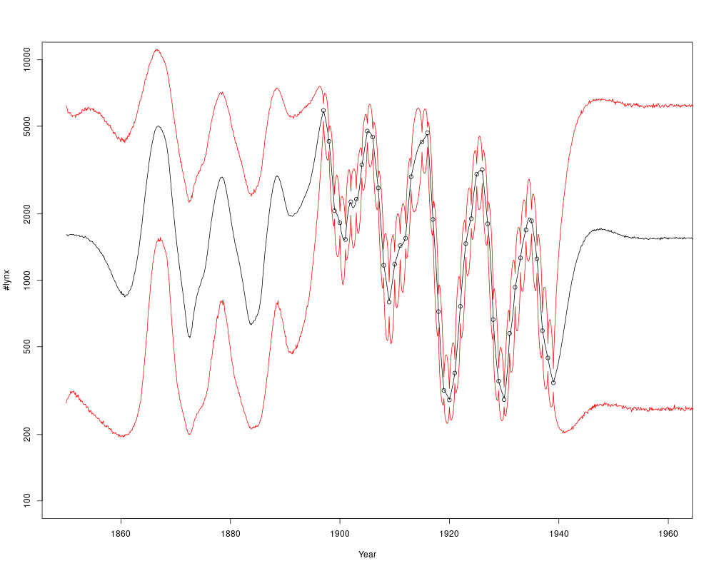

```{r, include = FALSE}
knitr::opts_chunk$set(
  collapse = TRUE,
  comment = "#>"
)
```


# 1.0 What is `layeranalyzer`?

The `layeranalyzer` package is a toolset for doing timeseries analysis with
a great variety of possible  models. These processes are continuous
in time and value, and the time series valued are seen as (flawed) samples
of them. If multiple processes are involved, (Granger) causal and
correlative links between them are possible. Each timeseries you provide
can be assigned many different process models, what we call 'model structure'.
Studying, selecting and estimating the model structure for a single timeseries
can be a goal in itself. Even with a single timeseries, multiple
processes can be involved, only one of which is linked directly to the data (thus the word 'layer' in `layeranalyzer`).

However, it is also possible to examine multiple timeseries at together, and look for links between the processes they represent. These links can be correlative in nature, meaning that the processes behind the various time series share a
common stochastic element. Many use regression analysis for examining correlations between time series, but this is not valid. Regression analysis assumes independent noise, but time series have auto-correlation (due to the underlying processes driving them). 

But the links can also be (Granger) causal, meaning
that one process affect the other in a predictable manner that accumulates in
time. Causal feedback-loops are also possible.

Section 2 describes installation. If you have already installed, you can skip to section 3, which gives a quick traversal of the most important concepts. Section 4 is an introduction to the models used (linear SDEs). It may be possible to skip this to go to section 5 which devles into example code, but if so you might have to double back to section 4 for some of the more specialized examples.

# 2.0 Installation.

## 2.1 Simple (vignette-free) installation.

While we want to put `layeranalyzer` on CRAN eventually, so far it is just available
on GITHUB. The packages `coda` and `Rcpp` and pre-required (so run
`install.packages("coda")` and `install.packages("Rcpp")` if you have not already).

Since `layeranalyzer` contains C++ code (in order to speed things up),
the package is compiled during installation. On Windows, that means that the
program "Rtools" (https://cran.r-project.prg/bin/windows/Rtools) is also
needed. On some installations (typically via a software center) there is
a environmental variable called "path" that may need to be set manually
(to include the binary folder for Rtools), though if things are
well-organized, this is not something you have to think of.

Once you have done this, installation should be as easy as typing (or copying)
```{r eval=FALSE}
install.packages("https://github.com/trondreitan/layeranalyzer/raw/master/layeranalyzer_0.2.1.tar.gz",
type="source",verbose=T)
```

Alternatively, you can install it using the package `devtools`. (Please note
that installing `devtools` typically take quite a bit of time.) Then installing
`layeranalyzer`can be done  by the command:
```{r eval=FALSE}
install_github(repo="trondreitan/layeranalyzer",dependencies=FALSE)
```

## 2.2 Installation with vignettes.

Vignettes are usage descriptions like the current text.
You can find the various vignettes associated with `layeranalyzer` by running
`browseVignettes()` or `vignette(,package="layeranalyzer")`.

If you want to have vignettes available, you need to install the packages
`knitr` and `markdown` and then compile `layeranalyzer` with the following option:
```{r eval=FALSE}
install.packages("https://github.com/trondreitan/layeranalyzer/raw/master/layeranalyzer_0.2.1.tar.gz",
   type="source",verbose=TRUE,build_vignettes=TRUE)
```
or if you use `devtools`:
```{r eval=FALSE}
install_github(repo="trondreitan/layeranalyzer",dependencies=FALSE,
  build_vignettes=TRUE)
```


# 3.0 Concepts

## 3.1 Time series vs processes

A time series is a set of measurements, each accompanied with a time point.
Examples: A collection of body size measurements derived from fossils with accompanying age estimates for a lineage of mammals, yearly temperature measurements at a spot (or globally), heart rate measurements from a heart rate monitor, yearly estimates of income inequality, etc. A time series represents a progression in time of something dynamic, but each measurements is a flawed representation of the state at of this something at the given time point.

That something is a process, some dynamic quantity out there in nature that has a state (in the form of one or more numbers) at any given time point, measured or otherwise. Examples are the real body size of a lineage of mammals, the actual temperature development as a function of time, the real heart rate as a function of time, income inequality as a function of time. Hypothesses and theories are concerned with processes, not time series, though the data comes in the form of time series. Time is assumed to be a continuum, and the function state is a function of time. This is illustrated in Fig. 1

```{r  out.width = "100%", echo = FALSE, fig.align="center", fig.cap="test"}
knitr::include_graphics("process_vs_timeseries.png") 
```
Figure 1. Process (black line) vs time series (red points) illustrated. measurements follow the process at the time points the measurements belong to, but with some independent noise added to them.

There are therefore two major differences between time series and process:

1. At the time point each measurement in the time series belongs to, there is a difference between the process state and the measurement due to measurement noise. In this package, measurement noise is assumed to be independent and additative (i.e. measurements=process state + noise). Note that if the nature of the measurements are so that they are process state multiplied with noise, this can be transformed to an additive model by log-transforming in measurement values in advance. The size of the measurement noise (the standard deviation of the measurement or the standard deviation of the samples that went into a given data point plus the number of samples) can be given. If not, it is estimated (assumed the same for all mesaurements).

2. There is a continuum of time and of things happening to the process in between each measurement. By far, this is usually the largest difference between process and time series. (Though for time series representing for instance yearly aggregates, this issue gets fuzzy.) How much things can happen in between measurements depend on how far apart in time they are. Note that in `layeranalyzer`, the time series, the time points need not be found in regular time intervals. Indeed, when doing connection analysis between two time series, the individual time points need not be the same. As long as the time spans of the two time series overlap, you can still find a connection. 

## 3.2 Linear stochastic differential equations (SDEs) 

The process models come in the form of linear stochastic differential equations
(linear SDEs). This is because linear SDEs allow for a great many different models, with all the features mentioned above. Linear SDEs contains a host of process models that are familiar to scientists in many fields and that describes meaningful hypotheses (this is in particular the case for phenotypic evolution in paleobiology). They are also tractable, meaning that a likelihood can be calculated, which is all we need for doing estimation (next subsection). The next section will describe linear SDEs in greater detail.

## 3.3 Estimation 

The `layeranalyzer` package has two ways of estimating model parameters,
Bayesian estimation and classic maximum-likelihood (ML) estimation. Bayesian estimation takes data and a prior distribution for the parameters as input, and outputs a posterior distribution for the parameters. The posterior distribution encodes where we expect the parameters to be as well as the uncertainties of these estimates. Classic maximum-likelihood (ML) estimation is performed by optimizing the likelihood (no prior distribution needed), but only gives estimates, not uncertainties. (These can be attained by other means, but these have yet to be implemented in `layeranalyzer`.)

The Bayesian way of estimation, using MCMC is default in `layeranalyzer`. A default (wide) prior distribution is used if the user does not specify it. MCMC is a way of sampling from the Bayesian distribution of parameter estimates. It can be a bit slow, but it is fairly robust. We found that ML failed on its own for more complicated models. However, even in those cases it tended to work if we used the MCMC samples as starting points for the ML optimization. Thus even when doing ML optimization, `layeranalyzer` uses MCMC to get to a good starting position for the optimization. Since MCMC is a stochastic (Monte Carlo) method, estimates will vary slightly from run to run. If the variation due to MCMC is too great, one can increase the computer resources needed, by increasing some of the MCMC settings. (Number of samples, spacing between samples, burn-in or parallel tempering to deal with multimodality. PS: Parallel tempering is particularly costly, but can get you out of likelihood troubles that no other method can.)

Classic hypothesis testing (only meaningful for ML estimation) can be done using the 'anova' method. (In `layeranalyzer`, this is done by chi-squared likelihood-ratio testing.) Model comparison can be performed using BIC, AIC or AICc for ML estimated models. For Bayesian estimated models, a model (marginal) likelihood is calculated (using importance sampling). If model comparison is not needed, one can turn off the estimation of model likelihood (as it does take some extra computer resources). 

# 4.0 Linear stochastic differential equations (SDEs), a quick overview.

## 4.1 The basic features of a linear SDE:

The `layeranalyzer` fits measurement data to linear SDEs, so it is good to have
an understanding of such processes, at least on a simplified form. 

Most features of linear SDEs can be examplied, using the Ornstein-Uhlenbeck
process:

$$ dX(t) = -a_X(X(t)-\mu_X)dt + \sigma_X dB_{t} $$

See Fig. 2 for a sampled OU process. The equation for the process
contains a deterministic part (the part in front of $dt$), which describes
an ordinary differential equation where the process ins being pulled towards
the value $mu_X$ in proportion to the displacement between the current value
and $mu_X$.

The relative 'speed' this happens with increases with increasing values
of the pull parameter, $a_X$. We re-parametrized $a_X$ to a characteristic
time, $\Delta t_X \equiv 1/a_X$.
The auto-correlation drops as $\rho(t)=e^{-t/\Delta t_X}$. Similarly, if you start
with a displacement from $\mu_X$, the expected value drops in a similar way:
$E[X(t)]=\mu_X+(X(t=0)-\mu_X) e^{-t/\Delta t_X}$. If $\mu_X$ was changing linearly,
the expected value of $X(t)$ would lag behind by $\Delta t_x$. All these reasons
are why we call this the characteristic time. Some may however be more familiar with
half-time, which is the time for the auto-correlation to drop to 1/2. This
will be $t_{X,1/2} \equiv log(2) \Delta t_X$. (`layeranalyzer` has an option for
reporting half-times instead of characteristic times).

The second term, $\sigma_X dB_{t}$, describes how stochasticity affects the system.
If we only have this term ($a_X=0$), then we have the Wiener process,
a normally distributed continuous time unbiased "random walk".
The parameter $\sigma_X$ describes
how much noise accumulates after one time unit. However, note that the dimension of
this parameter is whatever dimension your timeseries have (meters, cm, kg, volt)
divided by the __square root__ of the time unit! This is because it is
variance (standard deviation squared) which increases linearly with time, not
the size of the stochastic contribution itself. So two time units gives
$\sqrt{2}$ times as much noise (measured in standard deviations) as one time unit,
not twice the noise! For this reason, the $\sigma_X$ parameter is a bit difficult
to wrap ones head around. For the OU process however, one do not need to,
as the process is stationary, meaning that after a while it forgets it's origin
and converge towards a stable distribution (the Wiener process does not do this).

The stationary standard deviation, $s_X \equiv \sigma_X \sqrt{\Delta t_X}$, can
be reported instead of $\sigma_X$ in such cases. The stationary distribution itself
is normal, so $E(X(t))=\mu$ and $sd(X(t))=s_X$ summarizes that distribution,
while $\Delta t_X$ (or $t_X$ in the figure) summarizes the auto-correlation.
Since we also assume the
measurement noise to be normally distributed (more on that later), then the
measurements themselves (process+measurement noise) should also be normally
distributed, as long as you are in the stationary phase (more ont that later).
So, if there are good reason for assuming stationarity from the beginning of
your measurements, then checking for normality before starting the analysis, could be
wise. If they deviate much from normality, then perhaps a data transformation is in
order (more also on that later).

```{r  out.width = "100%", echo = FALSE, fig.align="center", fig.cap="test"}
knitr::include_graphics("ou.png") 
```
Figure 2. A sampled OU process, with the parameters illustrated
(expected value, $\mu_X$, characteristic time, $t_X$, and stationary
standard deviation (here illustrated by the 95% credibility interval,
$\mu_X-1.96s_x$ to $\mu_X+1.96s_X$).

While the OU process is stationary, that only means it will converge to a
stationary phase, not that it necessarily started out in such a state.
Fig. 3 shows how the process behaves when it starts far from the stationary
expected value, $\mu_X$. It drops exponentially down to $\mu_X$ and
converges towards the stationary behaviour. If it is possible that your
OU process starts off outside the equilibrium state, that can be modelled
by adding a parameter for the initial state. Typically, the initial state is
set at the time of the first measurement, but optionally you can put it at a
fixed time point before that. If you are analyzing non-stationary processes
(like the Wiener process), an initial value parameter is necessary. Also, if
a mix of several models, some that are non-stationary, then each will be
given such an initial value parameter.


```{r  out.width = "100%", echo = FALSE, fig.align="center", fig.cap="test"}
knitr::include_graphics("ou2.png") 
```
Figure 3. A sampled OU process that starts out far from the stationary expected value
(so unlikely to come from the stationary distribution). The red line shows the
expected value of the process as a function of time.

The OU process contains most of the elements that can describe a single
linear SDE models. However, different processes can be linked, and can
be utilized to describe different time series, or a single time series.

Note that in `layeranalyzer`, the characteristic time $\Delta t_X$ (or alternative
the pull, $a_X$) is assumed to be positive. If it was negative, you could get
the same situation as in Fig. 3, but reversed, i.e. you start with small values,
but then the process "blows up". There is an option for allowing for
negative pulls, but it is default turned off. This however also demonstrates
the importance of getting the time axis right. The linear SDEs are  models for how
thing changes forward in time. If your measurements are associated with ages
instead of time points, then you should reverse that, or your estimates may
not make much sense! (This becomes even more important when considering
causal links, see later). You can do this, simply by letting a time point be
minus the age $t = - age$, so that $t=0$ is the present time. Or you can do this
by letting the starting time be at the first measurement, $t = max(age)-age$. Then
$t=0$ is the time of the first measurement and $t=max(age)$ is the present time.

I advice against rescaling time according to the range of the measurements,
so typically to the interval $0-1$. Several of the
parameters are associated with time, most notably the characteristic time,
$\Delta t_X$ but also $\sigma_X$. In order to interpret the estimate of
$\Delta t_X$, you would have to scale that estimate back to real time,
if you first rescaled it. And this becomes even harder to do with
$\sigma_X$, which has dimension "measurement scale"
per square root time. With time rescaled, scaling an estimated $\sigma_X$
from your rescaled time back to actual time units can be tricky.  

Interpreting parameter can be necessary, since different explainations
may work on different time scales. So for instance, for phenotypic evolution
through natural selection, such a process can change things slightly in the
course of just a few generations, if there are no strong restrictions on
the process. Thus if the estimated characteristic time is several millions
of years, it could instead be the effect of changes in a driver of
evolution (some environmental driver) you see the effect of. It is also
possible to interpret the stochastic contribution parameter,
$\sigma_X$ though this is hard. In phenotypic evolution, the process
of natural selection plus genetic drift on a stable optimum has a
value for $\sigma_X$ determined by the genetic variance, the heredity and
the effective population size, thus some parameter values are admissable while
others are not. If unrealistic values are found according to one interpretation,
that can serve to rule out that interpretation in favor of the alternatives.


## 4.2 Elements of linked processes

### 4.2.1 Correlated processes

If you have two processes belonging to two different time series, they can
be linked correlatively. This can be expressed as two different OU (or Wiener)
processes that share a single stochastic component:

$$ dX_{1} (t) = -\frac{1}{\Delta t_1}(X_{1}(t)-\mu_{1})dt + \sigma_{1} dB^{(1)}_{t} $$
$$ dX_{2} (t) = -\frac{1}{\Delta t_2}(X_{2}(t)-\mu_{2})dt + \sigma_{2}(\rho dB^{(1)}_{t} + \sqrt{1-\rho^{2}} dB^{(2)}_{t} $$

See Fig. 4 for an example of two correlated OU processes. Note that $\rho$ is
the correlation between the stochastic contribution. It is not the correlation between
process $X_1(t)$ and process $X_2(t)$, unless the characteristic times are the same (as
in Fig. 4). If $\Delta t_1 \ne \Delta t_2$ then the correlation between the
two processes will be lower than $\rho$.

While this equation looks asymmetric, the common noise term can be moved
around between process $X_{1}(t)$ and $X_{2}(t)$. You can put linked (or unlinked)  into a single vector expression:

$$d\underline{X}(t)=-A(\underline(X)(t)-\underline{\mu})dt+\Sigma d\underline(B)_t                   (1)$$,  

Here underline signifies a vector, A is the so-called pull matrix (diagonal with $1/\Delta_1$ and
$1/\Delta_2$ on the diagonal in this case) and $\Sigma$ as the stochasticity matrix,
it is not the $\Sigma$ matrix but the variance-covariance matrix of the stochastic
contributions, $\Sigma \Sigma^t$, that matters. In the case above, we can write

$\Sigma \Sigma^t= \begin{pmatrix} \sigma_1^2 & \rho \sigma_1 \sigma_2\\\\ \rho \sigma_1 \sigma_2 & \sigma_2^2 \end{pmatrix}$

```{r  out.width = "100%", echo = FALSE, fig.align="center", fig.cap="test"}
knitr::include_graphics("ou_correlated.png") 
```
Figure 4. Sampling of two correlated OU processes, where $\mu_1=3$, $\mu_2=2$,
$\Delta t_1=\Delta t_2=1$ and $\sigma_1=\sigma_2=1$.

### 4.2.2 Causally linked processes

The two processes can however instead be causally linked, for instance by
$X_2$ affecting $X_1$.

$$ dX_1(t) = -\frac{1}{\Delta t_1}(X_1(t)-\mu_1-\beta(X_2(t)-\mu_2))dt + \sigma_1 dB^{(1)}_{t} $$
$$ dX_2(t) = -\frac{1}{\Delta t_2}(X_2(t)-\mu_2)dt + \sigma_2 dB^{(2)}_{t} $$

Now, $X_1(t)$ will lag behind $X_2(t)$, see Fig. 5. Process $X_1(t)$ is not
no longer an OU process, since in addition to having its own OU-like dynamics,
it also inherits the dynamics of process $X_2(t)$. If $X_2(t)$ flatlined,
then $X_1(t)$ would be an OU process.

Since the effect lags behind the cause, this makes it extra important to
have time go the right way! If you use age to set the time points,
you may very well end up switching cause and effect!

```{r  out.width = "100%", echo = FALSE, fig.align="center", fig.cap="test"}
knitr::include_graphics("causal.png") 
```
Figure 5. Sampling of two processes, one cause, $X_2(t)$ and one effect, $X_1(t)$.
The cause, $X_2(t)$, is an OU process with parameters $\mu_2=2$,
$\sigma_2=0.63$ and $\Delta t_2=5$. The effect, $X_1(t)$ is an OU-like
tracking of $X_2(t)$ with $\mu_1=3$, $\sigma_1=0.1$ (so not much stochastic
dynamics of its own), $\Delta t_2=2$ and causal connection parameter $\beta=1$.
You can see the peaks and valleys come a little after in process 1 than process 2. 

### 4.2.3 Causally feedback loops

We think of causality as running in one direction, and this is true for events. But a process is a whole continuum of events. Thus it is perfectly possible for process A to causally affect process B and also for process B to causally affect process A. This is what is called a causal feedback loop. They are particularly of interest when one causal effect is possitive while the other is negative. In that case, pseudo-cyclic behaviour can appear. The 'pseudo' in pseudo-cyclic means that there is no exact cycle time. This is because the cyclicity comes from the interplay of the two processes, so if one process is delayed due to stochasticity, the other process does not try to correct it but instead gets a delayed effect also. Pseudo-cyclic behaviour is precisely what you should expect when the cyclicity is due to internal mechanics of the system rather than impose from some external cyclic influense.

Mathematically such a system can be described like this:
$$ dX_1(t) = -\frac{1}{\Delta t_1}(X_1(t)-\mu_1-\beta_1(X_2(t)-\mu_2))dt + \sigma_1 dB^{(1)}_{t} $$
$$ dX_2(t) = -\frac{1}{\Delta t_2}(X_2(t)-\mu_2-\beta_2(X_1(t)-\mu_1))dt + \sigma_2 dB^{(2)}_{t} $$

An example of such a system is shown in Fig. 6. 

Figure 7. Two processes in a causal feedback loop., $X_1(t)$ (black line),
the cause process $X_2(t)$ (red line) and vice versa. In this case $\Delta t_1=\Delta t_2=0.05$ while $\beta_1=-20$ and $\beta_2=+20$.


## 4.3 Layers, so many layers!

### 4.3.1 What's a hidden layer?

With a causal connection, the effect is no longer an OU process. This can be seen
in the auto-correlation, which becomes more complicated,
see Fig. 7. In the first phase, the auto-correlation of $X_1(t)$ (the effect) drops
off like the OU process it would be
if $X_2(t)$ was a flat line (red line). But in the second phase, it levels off the same
way $X_2(t)$ does (blue line).


```{r  out.width = "100%", echo = FALSE, fig.align="center", fig.cap="test"}
knitr::include_graphics("causal_autocorr.png") 
```
Figure 7. Auto-correlation of the effect process, $X_1(t)$ (black line),
the cause process $X_2(t)$ (blue line) and the OU process that
$X_1(t)$ would be if $X_2(t)$ flatlined (red line). Here, $\sigma_1=1$,
$\sigma_2=0.15$, $\Delta t_1=1$, $\Delta t_2=10$ and $\beta=1$.
($\mu_1$ and $\mu_2$ are irrelevant).

For causal links, you do not need to measure both processes in order to detect them
both, though! This is where hidden layers come in. We can have the same situation
as before, but now process $X_2(t)$ is not measured. Its existence is still detectable,
as can be seen in Fig. 7, and we can estimate $\Delta t_2$. The
location and scale (the mean and spread of its
distribution) is however unknown, so we set that by letting the hidden process
have the same expected value as the observed process and set $\beta=1$. (The
$\sigma_2$ parameter will still be estimated, but keep this in mind). Fig 8.
shows the schematics of such a layered system.

```{r  out.width = "100%", echo = FALSE, fig.align="center", fig.cap="test"}
knitr::include_graphics("2layered.png") 
```
Figure 8. Schematics of a 2-layered system. At the top are the measurements,
which are not going to be the exact state of the process at that measurement times
due to measurement noise (more on that later). The there is the observed layer,
layer 1 and beneath that is the causal driver, layer 2. Conceptually, under that
is a flat line representing the expected value. That could be absent in
case of the Wiener process, be replaced by a linear trend or even by another
layer.

### 4.3.2 Multiple hidden layers + deterministic layers

Multiple hidden layers can be detectable. The total number of layers will be
the number of hidden layers plus one, since you've also got the observed layer.
The layers are numbered from the observed layer and downwards, so layer 1 is
the observed layer, layer 2 is the layer that affects the observed layer directly,
whilelayer 3 will be the layer that affects layer 2, etc.

So for instance, a 3-layered system will look like this:
$$ dX_1(t) = -\frac{1}{\Delta t_1}(X_1(t)-X_2(t))dt + \sigma_1 dB^{(1)}_{t} $$
$$ dX_2(t) = -\frac{1}{\Delta t_2}(X_2(t)-X_3(t))dt + \sigma_2 dB^{(2)}_{t} $$
$$ dX_3(t) = -\frac{1}{\Delta t_3}(X_3(t)-\mu)dt + \sigma_3 dB^{(3)}_{t} $$

Note that if this was not a hidden layer system, but all processes were measured directly, the exprsssion would have an expected value $\mu$ and causal strength $\beta$ for each layer above the bottom layer. In a layered system these parameters can be dropped (see the section on identifiability).

Further simplications are possible when dealing with multiple layers. For instance, the
bottom layer can be a Wiener process rather than an OU process (so skipping the
deterministic part).

Also, the layers above the bottom layer can be without the stochastic
parts, i.e. determinsitic layers. These layers will be smoother, have a derivative
(something the OU and the Wiener process does not have). In a 3-layered
system, you can even have a second derivate, making layer 1 quite smooth,
see Fig. 9.


```{r  out.width = "100%", echo = FALSE, fig.align="center", fig.cap="test"}
knitr::include_graphics("3layers_2det.png") 
```
Figure 9. Simulated 3-layered system. Black=first (observed) layer,
red=second layer, blue=third layer. Only the third layer has stochastic
contributions in this case. Layer 2 will thus have a derivate, while
layer 1 will both have a first and second derivate. Layer 2 and 3 have been
offset below each other, in order to make the figure more readable.


If you have multiple time series, each with multiple layers, connection between
them can be between the observed layers, but they can also be in the hidden layers.
Or it can be a combinatiom, so for instance, it can be that the hidden layer of
one process affects the observed layer of another (a common cause scenario).

I decided to cap the number of possible layers to 100, as I used some
fixed arrays to read and populate the model structure in my code. I cannot
think of a case where more than 100 layers for a single timeseries is needed
and are detectable, but if so, please tell me!

### 4.3.3 Special layer connections

Causal feedback loops between two processes is possible and detectable, even if the two processes both belong
to the same time series (so a feedback loop between the observed layer and the
hidden layer in a 2-layered system, for instance). 

The observed layer can be the cumulative effect of a hidden layer, in the sense
that it is the integral of the hidden layer. This is called an integration layer,
and is a very special kind of hidden layer (usually not explored).

### 4.3.4 Missing and collapsed layers (for the most interested)

Sometimes more than one layer is expected but not found. For instance, phenotypic evolution (such as the dynamics of body size) is expected to track an optimum which may also be expected to change during the span of the phenotypic time series. Thus one may expect two layers here, the phenotype itself as the observed layer and the optimum as the hidden layer.

There are several reasons why layer may not be found:

1. Insufficient data: Some data is needed to separate two layers. I would not expect that mutiple layers can be found with less than 40-50 data points even in the best of circumstances.

2. Collapsed layer (1): The measured process cannot be distinguished from the hidden layer at the given time resolution. If the smallest time interval in your time series is (for instance) in the order of 100ky, while the top (measured) layer is determinstic and has a characteristic time much shorter than the smallest time interval, for instance 1ky, then the top layer and the hidden layer cannot separated. For all intents and purposes, measured layer=hidden layer. If you coud extend your time series, it would not help. Even if you got more measurement in between the ones you already have, this would not help, unless you could reduce the intervals down towards the characteristic time of the top layer. This problem appeared for a phenotypic time series for a very abundant lineage where genetic drift was expected to be negligible (thus in practise, phenotypic evolution would be determinstic). The intervals were larger than 100ky while the expected the characteristic time of the phenotypic evolution was less than 0.1ky. (In addition, there was bioturbation, which mixed fossils at a scale of about 1ky, so no amount of sampling would have helped either.) PS: The collapsed layer does not need to be the top layer, though it is the easiest case I can imagine.

3. Collapsed layer (2): In the case where the measurement noise size is unknown (and thus in need of estimation), the top layer may be stochastic and still undetectable. As in case 2, the characteristic time of the top layer has to be significantly smaller than the time intervals of the time series. In this case, there is no way of separating the stochastic contributions from the first layer from the meuasrement noise, as the time intervals are too large to detect the tiny autocorrelation due to the dynamics of the top layer. PS: If the measurement noise is known, one can still detect a top layer that has characteristic time shorter than the time intervals, as the stochasticity in the time series will not match the specified measurement noise. In this case, one will get a good estimate of the stationary standard deviation of the top olayer, but not the $\sigma$ parameter or the characteristic time (which will just be estimated to something well below the smallest length of the time intervals in the series). PS: If the measurement noise provided in the time series is underestimated, this may cause `layeranalyzer` to detect am extra layer just to bridge the gap between the provided measurement noise size and the actual measurement noise size!

### 4.3.5 Identifiability issues with hidden layers

There are some identifiability issues with hidden layers. Firstly, the location(expected value) and scale (standard deviation) of a hidden layer cannot be identified. This is why in the case of hiddden layers, the location is assumed to be the same for all layers and the causal connection is assumed to have the value 1. So for instance for a two-layered system simplifies to:

$$ dX_1(t) = -\frac{1}{\Delta t_1}(X_1(t)-X_2(t))dt + \sigma_1 dB^{(1)}_{t} $$
$$ dX_2(t) = -\frac{1}{\Delta t_2}(X_2(t)-\mu_X)dt + \sigma_2 dB^{(2)}_{t} $$

Note that the location parameter, $\mu_X$ is put in the lowest layer, which then permiates upwards through the causal chain. Thus top layer has no reference to the location. Also the effect of the hidden layer is so that a change of one unit in that layer yields a change of one unit in the top layer over time.

Thus, when reconstructing hidden layers (more on this later), it is worth noting that the location and scale can be different than what the analysis yields. The hidden layer can indeed be flipped along the vertical axis, making tops into valleys and vice versa. The choice of idenficiation here comes from phenotypic evolution, where it makes no sense to put the optimum and a different scale or location than the phenotype itself.

A more subtle identification problems was noted in the supplementary of Reitan et al. (2012): It is possible to switch the characteristic time of two layers, while redefining the stochastic cotributions $\sigma$ so that the meeasured dynamics stay the same. A slow tracking of a fast moving hidden layer ($\Delta t_1>\Delta t_2$ can always be turned into a fast tracking of a slow moving hidden layer $\Delta t_1<\Delta t_2$, but not always vice versa. Those cases where fast tracking of a slow moving hidden layer cannot be turned into a slow tracking of a fast moving hidden layer are the cases where two added OU processes can be turned into fast tracking of a slow moving hidden layer. In `layeranalyzer`, this identifiability issue is fixed by imposing that  $\Delta t_i<\Delta t_{i+1}$ for all layers, i.e. layers further "down" are always slower than layers further "up". For Bayesian analysis, this meant imposing restrictions in the prior distribution of characeristic times so that the width of the prior distribution could be retained. (If not, the Bayesian analysis would favor multi-layered models over single-layered models,as long as the prior was not defined to narrowly).

Lastly, if a hidden layer does not just affect the top layer of the time series it belongs to but also processes belonging to a different time series, one is dealing with a common cause situation. In such cases, the common cause might as well be assigned to the second as the first time series.

### 4.3.6 Sites

Some time series may be sampled for multiple sites (as in Reitan et al 2012). Each site is assumed to have a process attached to it, and also possible hidden layers. The processes at different sites can be connected, but only though correlative connections. These correlation connections can be found in the top layer, but can also be placed in hidden layers (if the model has hidden layers). There is a vaste suite of options concerning correlations.  Typically the correlations are assumed to be the same for all sites, but it is aslo possible to estimate the correlation for each site pair. Another option is to have a layer with perfect correlation, meaning that the stochastic contributions are the same for all sites. More subtly, one can have a model where the analysis tries to separate out two different sets of sites with different correlation. or one can specify which sites are assumed to be correlated and which are not. 

It is also possible to explore whether the a given parameter is regional, i.e. different for different site, or global (default). It is also possible to find estimate groups of sites (max to groups) with the same parameter value. The modelling complexities increase greatly when dealing with sites!

### 4.3.7 Reconstruction and realizations

Given the measurements, it can be of interest to infer where a process has been going, both between the measurements (interpolation) and outside the span of the time series (extrapolation). Even at the time of a measurement, the inferred process will be a compromise between that measurement and what the model knows about the process and the surrounding measurements.

This is illustrated in Fig. 10, which shows a causally linked (feedback loop) system consisting of hare and lynx abundance indicators (really capture data), taken from Reitan&Liow (2019). The uncertainty "bubbles" out between ordinary measurements, though this may not be so interesting for a system where the measurements are diffusely place in time for each year. What is more of interest is in the extrapolated areas, especially for lynx in the time period 1860 to 1897. While there are no data points for lynx there, there are data points for hares. Thus with a causal connection between the two, the uncertainty is reduced compared to far outside the span of both datasets. Thus some structure can be seen for the lynx inference, even with no direct measurements. Notice how the uncertainty increases going before the first measurement and after the last mesaurement. The uncertainty does not immediately become that of the stationary distribution, but instead gradually increase to it, the further from the span of the datasets one go.

```{r  out.width = "100%", echo = FALSE, fig.align="center", fig.cap="test"}
knitr::include_graphics("hare_inf.png") 
```
```{r  out.width = "100%", echo = FALSE, fig.align="center", fig.cap="test"}
 
```
Figure 10. Inferred hare-lynx abundance processes with uncertainty, plus measurements.

Maybe even more interestingly, it is possible to do realization analysis on hidden layers. This was done for the hidden layer in a macroevolutionary diversification study, see Fig. 11 and Reitan&Liow (2017). We are currently not aware what potential driver this can be. Note that the inference comes with the identifiability issue (see subsection 4.3.5) of not knowing the location or scale of hidden layers. Potentially, the graph should be flipped around a vertical axis.

```{r  out.width = "100%", echo = FALSE, fig.align="center", fig.cap="test"}
knitr::include_graphics("brach_ext.jpg") 
```
Figure 11. Inferred hidden layer for brachipod extinction rates (controlling for bivalve extinction rates, which are causally linked to brachipod extinctionr ates), see Reitan&Liow 2017. Note that layer 2 is here called "hidden layer 1".

Fig. 12 illustrates the feasibility of process inferrence on hidden layers, by way of simulations (taken from Connor et al. 2024). A two layered system was simulated and a set of "measurements" were extracted to yield a time series. The hidden process was the given a parameter estimation and subsequent reconstruction. As can be seen in the figure, the reconstruction follows the actual process fairly well.


```{r  out.width = "100%", echo = FALSE, fig.align="center", fig.cap="test"}
knitr::include_graphics("hidden_sim.gif") 
```
Figure 12: Simulated hidden process as a black line, observed layer as a grey line, time series as circles and reconstructed hidden layer in blue.


Technically, the reconstructions are achieved by Kalman smoothing (which performs process inference given the data and the parameters) and if the inference is Bayesian also through MCMC sampling (which corrects for parameter uncertainty). Thus in a Bayesian setting, you can get the process estimates and uncertainty conditioned only on the data. `layeranalyzer` was then used for reconstructing the  hidden layer.

### 4.3.8 Positive pull

In eq. 1, the term before the determinstic part is called $-A$. originally, we did not put a minus in front but rather put an extra minus sign into the elements of this matrix, which was called the "pull matrix", $P \equiv -A$. A negative element on the diagonal of $P$ (i.e. a positive on for $A$) means that when disreagarding the effects of the other processes, the process is pulled towards a mean value. I.e. it is stationary. A positive element on diagonal of the pull matrix $P$ (i.e. a negative element for $A$) means that a deviation from the expected value will instead grow (again when the process is left to itself) exponentially! This is in most regards not an expected behaviour for most processes studied as time series, as exponential growth is typically not sustainable in time. Thus 

However, there may be instances 


# 5 Example code


# References

* Reitan, T. Schweder and Henderiks, J. (2012) 
"Phenotypic Evolution studied by Layered Stochastic Differential Equations".
Annals of Applied Statistics, Volume 6(4): 1531-1551. DOI: 10.1214/12-AOAS559

* Reitan, T., Liow, L.H. (2017)
"An unknown Phanerozoic driver of brachiopod extinction rates unveiled by multivariate linear stochastic differential equations</em>."
Paleobiology, Published online.
DOI: 10.1017/pab.2017.11

* Reitan, T., Liow, L.H. (2019).
"layeranalyzer: Inferring correlative and causal connections from time series data in R"
Methods in Ecology and Evolution, available online.
DOI: 10.1111/2041-210X.13299

* Connor, J.W., Reitan, T., Liow L.H (2024)
"Unveiling the undelrying drivers of Phanerozoic marine diversification".
Proceeding of the Royal Society B 291.
DOI: 10.1098/rspb.2024.0165
