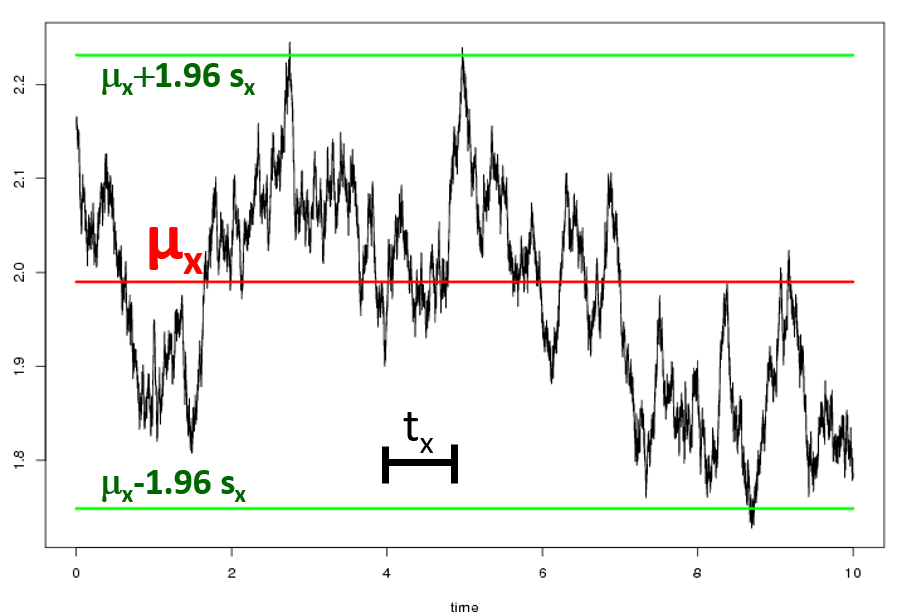
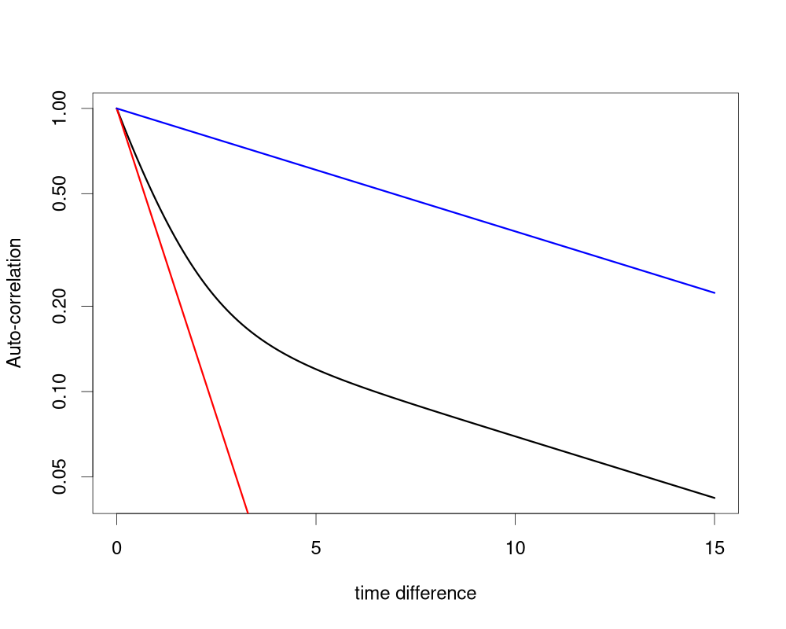

# 1.0 What is `layeranalyzer`?

The `layeranalyzer` package is a toolset for doing timeseries analysis with
a great variety of possible process models. These processes are continuous
in time and value, and the time series valued are seen as (flawed) samples
of them. If multiple processes are involved, (Granger) causal and
correlative links between them are possible. Each timeseries you provide
can be assigned many different process models, what we call 'model structure'.
Studying, selecting and estimating the model structure for a single timeseries
can be a goal in itself. Even with a single timeseries, multiple
processes can be involved, only one of which is linked directly to the data (thus the
work 'layer' in `layeranalyzer`).

However, it is also possible to examine multiple timeseries at together, and
look for links between the processes they represent. These links can be correlative
in nature, meaning that the processes behind the various time series share a
common stochastic element. But the links can also be (Granger) causal, meaning
that one process affect the other in a predictable manner that accumulates in
time. Causal feedback-loops are also possible.

The process models come in the form of linear stochastic differential equations
(linear SDEs). This is because linear SDEs allow for a great many different models,
with all the features mentioned above. They are also tractable, meaning that
a likelihood can be calculated, which is all we need for doing Bayesian and
classic maximum-likelihood (ML) estimation. The Bayesian way of estimation,
using MCMC is default. MCMC is a way of sampling from the Bayesian distribution
of parameter estimates. It can be a bit slow, but it is fairly robust. We found
that ML failed on its own for more complicated models. However, even in those
cases it tended to work if we used the MCMC samples as starting points for the
ML optimization.

# 2.0 Installation.

## 2.1 Simple (vignette-free) installation.

While we want to put `layeranalyzer` on CRAN eventually, so far it is just available
on GITHUB. The packages `coda` and `Rcpp` and pre-required (so run
`install.packages("coda")` and `install.packages("Rcpp")` if you have not already).

Since `layeranalyzer` contains C++ code (in order to speed things up),
the package is compiled during installation. On Windows, that means that the
program "Rtools" (https://cran.r-project.prg/bin/windows/Rtools) is also
needed. On some installations (typically via a software center) there is
a environmental variable called "path" that may need to be set manually
(to include the binary folder for Rtools), though if things are
well-organized, this is not something you have to think of.

Once you have done this, installation should be as easy as typing (or copying)

```r
install.packages("http://folk.uio.no/trondr/R/layeranalyzer_0.1.1.tar.gz",type="source",verbose=T)
```

Alternatively, you can install it using the package `devtools`. (Please note
that installing `devtools` typically take quite a bit of time.) Then installing
`layeranalyzer`can be done  by the command:

```r
install_github(repo="trondreitan/layeranalyzer",dependencies=FALSE)
```

## 2.2 Simple (vignette-free) installation.

Vignettes are usage descriptions like the current text.
You can find the various vignettes associated with `layeranalyzer` by running
`browseVignettes()` or `vignette(,package="layeranalyzer")`.

If you want to have vignettes available, you need to install the packages
`knitr` and `markdown` and then compile `layeranalyzer` with the following option:

```r
install.packages("http://folk.uio.no/trondr/R/layeranalyzer_0.1.1.tar.gz",type="source",verbose=TRUE,
   build_vignettes=TRUE)
```
or if you use `devtools`:

```r
install_github(repo="trondreitan/layeranalyzer",dependencies=FALSE,build_vignettes=TRUE)
```


# 3.0 Linear stochastic differential equations (SDEs), a quick overview.

## 3.1 The basic features of a linear SDE:

The `layeranalyzer` fits measurement data to linear SDEs, so it is good to have
an understanding of such processes, at least on a simplified form. 

Most features of linear SDEs can be examplied, using the Ornstein-Uhlenbeck
process:

$$ dX(t) = -a_X(X(t)-\mu_X)dt + \sigma_X dB_{t} $$

See Fig. 1 for a sampled OU process. The equation for the process
contains a deterministic part (the part in front of $dt$), which describes
an ordinary differential equation where the process ins being pulled towards
the value $mu_X$ in proportion to the displacement between the current value
and $mu_X$.

The relative 'speed' this happens with increases with increasing values
of the pull parameter, $a_X$. We re-parametrized $a_X$ to a characteristic
time, $\Delta t_X \equiv 1/a_X$.
The auto-correlation drops as $\rho(t)=e^{-t/\Delta t_X}$. Similarly, if you start
with a displacement from $\mu_X$, the expected value drops in a similar way:
$E[X(t)]=\mu_X+(X(t=0)-\mu_X) e^{-t/\Delta t_X}$. If $\mu_X$ was changing linearly,
the expected value of $X(t)$ would lag behind by $\Delta t_x$. All these reasons
are why we call this the characteristic time. Some may however be more familiar with
half-time, which is the time for the auto-correlation to drop to 1/2. This
will be $t_{X,1/2} \equiv log(2) \Delta t_X$. (`layeranalyzer` has an option for
reporting half-times instead of characteristic times). 

The second term, $\sigma_X dB_{t}$, describes how stochasticity affects the system.
If we only have this term ($a_X=0$), then we have the Wiener process,
a normally distributed continuous time unbiased "random walk".
The parameter $\sigma_X$ describes
how much noise accumulates after one time unit. However, note that the dimension of
this parameter is whatever dimension your timeseries have (meters, cm, kg, volt)
divided by the __square root__ of the time unit! This is because it is
variance (standard deviation squared) which increases linearly with time, not
the size of the stochastic contribution itself. So two time units gives
$\sqrt{2}$ times as much noise (measured in standard deviations) as one time unit,
not twice the noise! For this reason, the $\sigma_X$ parameter is a bit difficult
to wrap ones head around. For the OU process however, one do not need to,
as the process is stationary, meaning that after a while it forgets it's origin
and converge towards a stable distribution (the Wiener process does not do this).

The stationary standard deviation, $s_X \equiv \sigma_X \sqrt{\Delta t_X}$, can
be reported instead of $\sigma_X$ in such cases. The stationary distribution itself
is normal, so $E(X(t))=\mu$ and $sd(X(t))=s_X$ summarizes that distribution,
while $\Delta t_X$ (or $t_X$ in the figure) summarizes the auto-correlation.
Since we also assume the
measurement noise to be normally distributed (more on that later), then the
measurements themselves (process+measurement noise) should also be normally
distributed, as long as you are in the stationary phase (more ont that later).
So, if there are good reason for assuming stationarity from the beginning of
your measurements, then checking for normality before starting the analysis, could be
wise. If they deviate much from normality, then perhaps a data transformation is in
order (more also on that later).


Figure 1. A sampled OU process, with the parameters illustrated
(expected value, $\mu_X$, characteristic time, $t_X$, and stationary
standard deviation (here illustrated by the 95% credibility interval,
$\mu_X-1.96s_x$ to $\mu_X+1.96s_X$).

While the OU process is stationary, that only means it will converge to a
stationary phase, not that it necessarily started out in such a state.
Fig. 2 shows how the process behaves when it starts far from the stationary
expected value, $\mu_X$. It drops exponentially down to $\mu_X$ and
converges towards the stationary behaviour. If it is possible that your
OU process starts off outside the equilibrium state, that can be modelled
by adding a parameter for the initial state. Typically, the initial state is
set at the time of the fisrt measurement, but optionally you can put it at a
fixed time point before that. If you are analyzing non-stationary processes
(like the Wiener process), an initial value parameter is necessary. Also, if
a mix of several models, some that are non-stationary, then each will be
given such an initial value parameter.


Figure 2. A sampled OU process that starts out far from the stationary expected value
(so unlikely to come from the stationary distribution). The red line shows the
expected value of the process as a function of time.

The OU process contains most of the elements that can describe a single
linear SDE models. However, different processes can be linked, and can
be utilized to describe different time series, or a single time series.

Note that in `layeranalyzer`, the characteristic time $\Delta t_X$ (or alternative
the pull, $a_X$) is assumed to be positive. If it was negative, you could get
the same situation as in Fig. 2, but reversed, i.e. you start with small values,
but then the process "blows up". There is an option for allowing for
negative pulls, but it is default turned off. This however also demonstrates
the importance of getting the time axis right. The linear SDEs are  models for how
thing changes forward in time. If your measurements are associated with ages
instead of time points, then you should reverse that, or your estimates may
not make much sense! (This becomes even more important when considering
causal links, see later). You can do this, simply by letting a time point be
minus the age $t = - age$, so that $t=0$ is the present time. Or you can do this
by letting the starting time be at the first measurement, $t = max(age)-age$. Then
$t=0$ is the time of the first measurement and $t=max(age)$ is the present time.

I advice against rescaling time according to the range of the measurements,
so typically to the interval $0-1$. Several of the
parameters are associated with time, most notably the characteristic time,
$\Delta t_X$ but also $\sigma_X$. In order to interpret the estimate of
$\Delta t_X$, you would have to scale that estimate back to real time,
if you first rescaled it. And this becomes even harder to do with
$\sigma_X$, which has dimension "measurement scale"
per square root time. With time rescaled, scaling an estimated $\sigma_X$
from your rescaled time back to actual time units can be tricky.  

Interpreting parameter can be necessary, since different explainations
may work on different time scales. So for instance, for phenotypic evolution
through natural selection, such a process can change things slightly in the
course of just a few generations, if there are no strong restrictions on
the process. Thus if the estimated characteristic time is several millions
of years, it could instead be the effect of changes in a driver of
evolution (some environmental driver) you see the effect of. It is also
possible to interpret the stochastic contribution parameter,
$\sigma_X$ though this is hard. In phenotypic evolution, the process
of natural selection plus genetic drift on a stable optimum has a
value for $\sigma_X$ determined by the genetic variance, the heredity and
the effective population size, thus some parameter values are admissable while
others are not. If unrealistic values are found according to one interpretation,
that can serve to rule out that interpretation in favor of the alternatives.


## 3.2 Elements of linked processes

### 3.2.1 Correlated processes

If you have two processes belonging to two different time series, they can
be linked correlatively. This can be expressed as two different OU (or Wiener)
processes that share a single stochastic component:

$$ dX_{1} (t) = -\frac{1}{\Delta t_1}(X_{1}(t)-\mu_{1})dt + \sigma_{1} dB^{(1)}_{t} $$
$$ dX_{2} (t) = -\frac{1}{\Delta t_2}(X_{2}(t)-\mu_{2})dt + \sigma_{2}(\rho dB^{(1)}_{t} + \sqrt{1-\rho^{2}} dB^{(2)}_{t} $$

See Fig. 3 for an example of two correlated OU processes. Note that $\rho$ is
the correlation between the stochastic contribution. It is not the correlation between
process $X_1(t)$ and process $X_2(t)$, unless the characteristic times are the same (as
in Fig. 3). If $\Delta t_1 \ne \Delta t_2$ then the correlation between the
two processes will be lower than $\rho$.

While this equation looks asymmetric, the common noise term can be moved
around between process $X_{1}(t)$ and $X_{2}(t)$. If you put this in a vectorial form,
$d\underline{X}(t)=-A(\underline(X)(t)-\underline{\mu})dt+\Sigma d\underline(B)_t$,
where underline signifies a vector, A is the pull matrix (diagonal with $1/\Delta_1$ and
$1/\Delta_2$ on the diagonal in this case) and \Sigma as the stochasticity matrix,
it is not the $\Sigma$ matrix but the variance-covariance matrix of the stochastic
contributions, $\Sigma \Sigma^t$, that matters. In the case above, we can write

$\Sigma \Sigma^t= \begin{pmatrix} \sigma_1^2 & \rho \sigma_1 \sigma_2\\\\ \rho \sigma_1 \sigma_2 & \sigma_2^2 \end{pmatrix}$


Figure 3. Sampling of two correlated OU processes, where $\mu_1=3$, $\mu_2=2$,
$\Delta t_1=\Delta t_2=1$ and $\sigma_1=\sigma_2=1$.

### 3.2.2 Causally linked processes

The two processes can however instead be causally linked, for instance by
$X_2$ affecting $X_1$.

$$ dX_1(t) = -\frac{1}{\Delta t_1}(X_1(t)-\mu_1-\beta(X_2(t)-\mu_2))dt + \sigma_1 dB^{(1)}_{t} $$
$$ dX_2(t) = -\frac{1}{\Delta t_2}(X_2(t)-\mu_2)dt + \sigma_2 dB^{(2)}_{t} $$

Now, $X_1(t)$ will lag behind $X_2(t)$, see Fig. 4. Process $X_1(t)$ is not
no longer an OU process, since in addition to having its own OU-like dynamics,
it also inherits the dynamics of process $X_2(t)$. If $X_2(t)$ flatlined,
then $X_1(t)$ would be an OU process.

Since the effect lags behind the cause, this makes it extra important to
have time go the right way! If you use age to set the time points,
you may very well end up switching cause and effect!


Figure 4. Sampling of two processes, one cause, $X_2(t)$ and one effect, $X_1(t)$.
The cause, $X_2(t)$, is an OU process with parameters $\mu_2=2",
$\sigma_2=0.63$ and $\Delta t_2=5$. The effect, $X_1(t)$ is an OU-like
tracking of $X_2(t)$ with $\mu_1=3", $\sigma_1=0.1$ (so not much stochastic
dynamics of its own), $\Delta t_2=2$ and causal connection parameter $\beta=1$.
You can see the peaks and valleys come a little after in process 1 than process 2. 

### 3.2.3 Causally feedback loops


## 3.3 Layers, so many layers!

With a causal connection, the effect is no longer an OU process. This can be seen
in the auto-correlation, which becomes more complicated,
see Fig. 5. In the first phase, the auto-correlation of $X_1(t)$ (the effect) drops
off like the OU process it would be
if $X_2(t)$ was a flat line (red line). But in the second phase, it levels off the same
way $X_2(t)$ does (blue line).



Figure 5. Auto-correlation of the effect process, $X_1(t)$ (black line),
the cause process $X_2(t)$ (blue line) and the OU process that
$X_1(t)$ would be if $X_2(t)$ flatlined (red line). Here, $\sigma_1=1$,
$\sigma_2=0.15$, $\Delta t_1=1$, $\Delta t_2=10$ and $\beta=1$.
($\mu_1$ and $\mu_2$ are irrelevant).

For causal links, you do not need to measure both processes in order to detect them
both, though! This is where hidden layers come in. We can have the same situation
as before, but now process $X_2(t)$ is not measured. Its existence is still detectable,
as can be seen in Fig. 5, and we can estimate $\Delta t_2$. The
location and scale (the mean and spread of its
distribution) is however unknown, so we set that by letting the hidden process
have the same expected value as the observed process and set $\beta=1$. (The
$\sigma_2$ parameter will still be estimated, but keep this in mind). Fig 6.
shows the schematics of such a layered system.


Figure 6. Schematics of a 2-layered system. At the top are the measurements,
which are not going to be the exact state of the process at that measurement times
due to measurement noise (more on that later). The there is the observed layer,
layer 1 and beneath that is the causal driver, layer 2. Conceptually, under that
is a flat line representing the expected value. That could be absent in
case of the Wiener process, be replaced by a linear trend or even by another
layer.


Multiple hidden layers can be detectable. The total number of layers will be
the number of hidden layers plus one, since you've also got the observed layer.
The layers are numbered from the observed layer and downwards, so layer 1 is
the observed layer, layer 2 is the layer that affects the observed layer directly,
whilelayer 3 will be the layer that affects layer 2, etc.

So for instance, a 3-layered system will look like this:
$$ dX_1(t) = -\frac{1}{\Delta t_1}(X_1(t)-X_2(t))dt + \sigma_1 dB^{(1)}_{t} $$
$$ dX_2(t) = -\frac{1}{\Delta t_2}(X_2(t)-X_3(t))dt + \sigma_2 dB^{(2)}_{t} $$
$$ dX_3(t) = -\frac{1}{\Delta t_3}(X_3(t)-\mu)dt + \sigma_3 dB^{(3)}_{t} $$

Simplications are possible when dealing with multiple layers. For instance, the
bottom layer can be a Wiener process rather than an OU process (so skipping the
determinsitic part).

On the other hand, layers above that can be without the stochastic
parts, i.e. determinsitic layers. These layers will be smoother, have a derivative
(something the OU and the Wiener process does not have). In a 3-layered
system, you can even have a second derivate, making layer 1 quite smooth,
see Fig. 7.


Figure 7. Simulated 3-layered system. Black=first (observed) layer,
red=second layer, blue=third layer. Only the third layer has stochastic
contributions in this case. Layer 2 will thus have a derivate, while
layer 1 will both have a first and second derivate. Layer 2 and 3 have been
offset below each other, in order to make the figure more readable.


Causal feedback loops between two processes is possible. In that case, you can get
pseudo-cyclic behaviour. This is even possible, if the two processes both belong
to the same time series (so a feedback loop between the observed layer and the
hidden layer in a 2-layered system, for instance). 

The observed layer can be the cumulative effect of a hidden layer, in the sense
that it is the integral of the hidden layer. This is called an integration layer,
and is a very special kind of hidden layer (usually not explored).

If you have multiple time series, each with multiple layers, connection between
them can be between the observed layers, but they can also be in the hidden layers.
Or it can be a cimbinatiom, so for instance, it can be that the hidden layer of
one process affects the observed layer of another (a common cause scenario).

I decided to cap the number of possible layers to 100, as I used some
fixed arrays to read and populate the model structure in my code. I cannot
think of a case where more than 100 layers for a single timeseries is needed
and are detectable, but if so, please tell me!


## Vignette Info

Note the various macros within the `vignette` section of the metadata block above. These are required in order to instruct R how to build the vignette. Note that you should change the `title` field and the `\VignetteIndexEntry` to match the title of your vignette.

## Styles

The `html_vignette` template includes a basic CSS theme. To override this theme you can specify your own CSS in the document metadata as follows:

    output: 
      rmarkdown::html_vignette:
        css: mystyles.css

## Figures

The figure sizes have been customised so that you can easily put two images side-by-side. 


```r
plot(1:10)
plot(10:1)
```


You can enable figure captions by `fig_caption: yes` in YAML:

    output:
      rmarkdown::html_vignette:
        fig_caption: yes

Then you can use the chunk option `fig.cap = "Your figure caption."` in **knitr**.

## More Examples

You can write math expressions, e.g. $Y = X\beta + \epsilon$, footnotes^[A footnote here.], and tables, e.g. using `knitr::kable()`.


|                  |  mpg| cyl|  disp|  hp| drat|    wt|  qsec| vs| am| gear| carb|
|:-----------------|----:|---:|-----:|---:|----:|-----:|-----:|--:|--:|----:|----:|
|Mazda RX4         | 21.0|   6| 160.0| 110| 3.90| 2.620| 16.46|  0|  1|    4|    4|
|Mazda RX4 Wag     | 21.0|   6| 160.0| 110| 3.90| 2.875| 17.02|  0|  1|    4|    4|
|Datsun 710        | 22.8|   4| 108.0|  93| 3.85| 2.320| 18.61|  1|  1|    4|    1|
|Hornet 4 Drive    | 21.4|   6| 258.0| 110| 3.08| 3.215| 19.44|  1|  0|    3|    1|
|Hornet Sportabout | 18.7|   8| 360.0| 175| 3.15| 3.440| 17.02|  0|  0|    3|    2|
|Valiant           | 18.1|   6| 225.0| 105| 2.76| 3.460| 20.22|  1|  0|    3|    1|
|Duster 360        | 14.3|   8| 360.0| 245| 3.21| 3.570| 15.84|  0|  0|    3|    4|
|Merc 240D         | 24.4|   4| 146.7|  62| 3.69| 3.190| 20.00|  1|  0|    4|    2|
|Merc 230          | 22.8|   4| 140.8|  95| 3.92| 3.150| 22.90|  1|  0|    4|    2|
|Merc 280          | 19.2|   6| 167.6| 123| 3.92| 3.440| 18.30|  1|  0|    4|    4|

Also a quote using `>`:

> "He who gives up [code] safety for [code] speed deserves neither."
([via](https://twitter.com/hadleywickham/status/504368538874703872))
